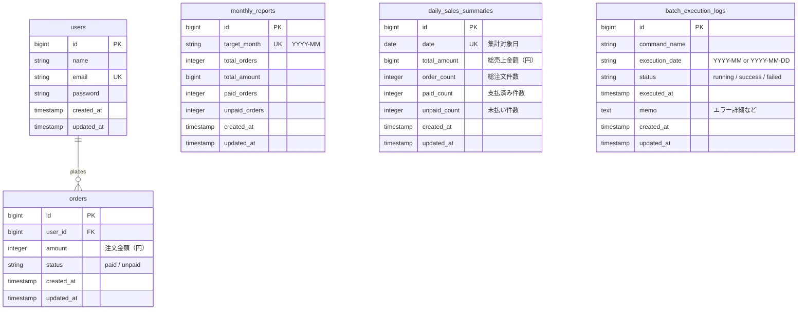
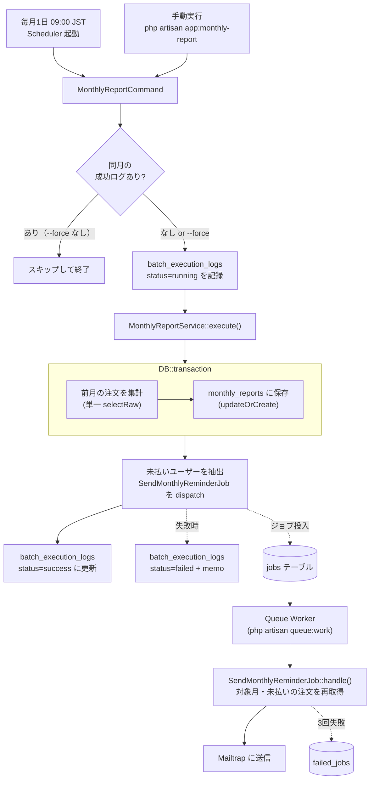
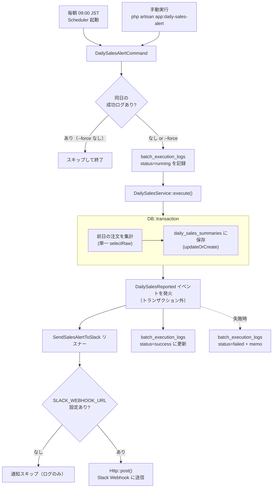
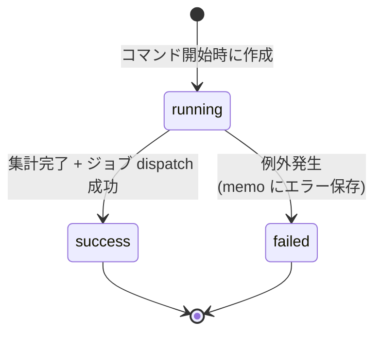

# laravel-batch

Laravel × Artisan Command × Queue × Mailable × Event/Listener によるバッチ処理のポートフォリオ実装です。

ECサービスを想定し、**月次集計バッチ**と**日次売上アラートバッチ**の2本を実装。バッチ処理特有の課題（**冪等性・タイムゾーン・非同期信頼性・外部API連携・イベント駆動設計**）に実務を意識した設計で取り組んでいます。

ポートフォリオ上の位置: **バッチ / 非同期** の実務例。プロフィール全体は [tetsushi-k](https://github.com/tetsushi-k)。

---

## ① 概要

Laravel 11 で実装した2本のバッチアプリケーションです。

### バッチ1：月次集計 + 未払いリマインドメール（`app:monthly-report`）

毎月1日に前月分の注文を集計し、未払いユーザーへリマインドメールを Mailable + database queue で非同期送信する。

- 毎月1日 09:00 JST に Scheduler から自動実行
- 集計結果を `monthly_reports` テーブルに保存
- 未払いユーザーへのリマインドメール送信（Queue 経由・非同期）
- `--force` オプションによる強制再実行

### バッチ2：日次売上アラート + Slack通知（`app:daily-sales-alert`）

毎朝前日の売上を集計し、Slack Incoming Webhook で通知する。Event / Listener パターンを採用し、集計ロジックと通知ロジックを疎結合に分離している。

- 毎朝 09:00 JST に Scheduler から自動実行
- 集計結果を `daily_sales_summaries` テーブルに保存
- `DailySalesReported` イベント発火 → `SendSalesAlertToSlack` リスナーが Slack 通知
- `--date` オプションで任意の日を対象に指定可能
- `SLACK_WEBHOOK_URL` 未設定時は通知をスキップして正常終了

### 共通の設計方針

- 実行履歴を `batch_execution_logs` に記録し、二重実行を抑止（冪等性）
- `--force` オプションで強制再実行可能
- `withoutOverlapping()` でスケジューラ多重起動を防止

開発は Cursor を使用。`.cursor/rules/` のポートフォリオ品質基準（不要なファイル・処理を足さない、README と実装の整合、Seeder で `make setup` 直後に再現）と README ガイド（共通章構成・Mermaid）に沿って実装している。

---

## ② 使用技術

| カテゴリ | 技術 |
|---|---|
| バックエンド | Laravel 11.x（PHP 8.2） |
| データベース | MySQL 8.0 |
| Web サーバー | Nginx 1.25 |
| コンテナ | Docker / Docker Compose |
| 非同期処理 | Laravel Queue（database driver） |
| メール送信 | Laravel Mailable / Mailtrap（ローカル確認用 SMTP） |
| Slack 通知 | Slack Incoming Webhook / Laravel HTTP Client |
| イベント設計 | Laravel Event / Listener |
| 定期実行 | Laravel Scheduler |
| タイムゾーン | Asia/Tokyo（JST） |
| テスト | PHPUnit 11 / SQLite in-memory |
| CI | GitHub Actions |

---

## ③ アーキテクチャ図

### ER図

`monthly_reports.target_month`、`daily_sales_summaries.date` それぞれに unique 制約を付けることで、同一月・同一日の集計レコード重複を DB レベルで防止。
`batch_execution_logs` は冪等性チェックの中核となるテーブルで、`(command_name, execution_date, status)` の組み合わせで成功済み判定を行う。



### バッチ1：月次集計フロー

Scheduler または手動実行を起点に、集計までは同期処理、メール送信は database queue に逃がして非同期処理する設計。
ジョブのディスパッチは `DB::transaction` の **外側** で行い、トランザクションがロールバックした際にジョブだけが残る不整合を防いでいる。



### バッチ2：日次売上アラートフロー

集計完了後に `DailySalesReported` イベントを発火し、Slack 通知の責務をリスナーに委譲するイベント駆動設計。
`SLACK_WEBHOOK_URL` 未設定時はリスナーが通知をスキップするため、Slack を持たない環境でもバッチ自体は正常に動作する。



### バッチ実行ログのライフサイクル（共通）

`batch_execution_logs.status` は `running → success / failed` の単方向遷移。
途中で例外が発生しても `running` のまま放置されず、必ず `failed` で終端することで「実行中」と「異常終了」が区別できるようにしている。



---

## ④ 設計上の工夫

### 冪等性の担保

毎月1日に走るバッチは、サーバー復旧後の再実行・運用者の手動再実行など **同月に複数回起動されるリスク** が常にある。本実装では `batch_execution_logs` を用いて二重処理を防止している。

- コマンド開始時に対象月の **`status=success` ログが存在するかチェック**し、あればスキップ
- 処理開始時に `status=running` のログを作成し、終了時に `success` / `failed` に更新
- `--force` オプションで成功ログを無視した強制再実行が可能
- `monthly_reports.target_month` の unique 制約と `updateOrCreate` により、再実行時もレコードが重複しない

```php
if (! $this->option('force') && BatchExecutionLog::hasSucceeded('app:monthly-report', $targetMonth)) {
    $this->warn("対象月 {$targetMonth} は既に処理済みです。");
    return self::SUCCESS;
}
```

### Service層によるロジック分離

コマンドクラスは「冪等性チェック・ログ記録・例外ハンドリング・コンソール出力」のみを担い、**ビジネスロジックは `MonthlyReportService` に集約**。
コマンドはフレームワーク依存の責務（Console I/O）に集中させ、Service はテスト時にユニットテスト可能な純粋なクラスとして切り出している。

### Queue による非同期メール送信

リマインドメール送信はバッチ本体から切り離し、`SendMonthlyReminderJob` として database queue に投入。
ユーザー数増加時もバッチ自体は一定時間で終了し、メール送信のリトライ・失敗管理は Queue のインフラに任せる設計。

- **リトライ**: 最大3回（`$tries = 3`）
- **指数バックオフ**: 60秒 → 120秒 → 240秒 で一時的な SMTP エラーを吸収
- **失敗時**: `failed_jobs` テーブルに記録され、`queue:retry` で個別再実行可能

### SerializesModels とキュー越しのデータ受け渡し

`SendMonthlyReminderJob` は `SerializesModels` を使用するため、Eloquent モデルはキュー保存時に **プライマリキーのみで直列化** される。Worker が取り出すとき `User::find($id)` で再取得するため、Service 側で設定した Eager Loading の絞り込み制約（対象月・未払い）は **消滅** する。

そのまま `$user->orders` を Blade で参照すると **全期間の注文がロードされる** バグが発生したため、Job の `handle()` 内で改めて絞り込み、フィルタ済みコレクションを Mailable に明示的に渡す設計に修正した。

```php
public function handle(): void
{
    $start = Carbon::createFromFormat('Y-m', $this->targetMonth, 'Asia/Tokyo')->startOfMonth();
    $end   = $start->copy()->endOfMonth();

    $unpaidOrders = $this->user->orders()
        ->whereBetween('created_at', [$start, $end])
        ->where('status', 'unpaid')
        ->orderBy('created_at')
        ->get();

    Mail::to($this->user->email)
        ->send(new MonthlyReminderMail($this->user, $this->targetMonth, $unpaidOrders));
}
```

### N+1 問題の回避

`MonthlyReportService::dispatchReminderJobs()` で未払いユーザーを取得する際、`whereHas` での絞り込みと `with()` での Eager Loading を組み合わせている（前述の通り Job 側で再取得するため Eager Loading の主目的は **絞り込みユーザー数のカウントを 1 クエリに収めること**）。
集計クエリも単一の `selectRaw` で `total_orders / total_amount / paid / unpaid` をまとめて取得し、複数クエリの発行を避けている。

### タイムゾーンの明示

`config/app.php` に `timezone = Asia/Tokyo` を設定し、`Carbon::now()` が常に JST を返すようにしている。
さらに Scheduler 側でも `->timezone('Asia/Tokyo')` を明示することで、サーバーのシステムタイムゾーンに依存せず **必ず JST の毎月1日 09:00** に実行される。

```php
Schedule::command('app:monthly-report')
    ->monthlyOn(1, '09:00')
    ->timezone('Asia/Tokyo')
    ->withoutOverlapping()
    ->appendOutputTo(storage_path('logs/batch-monthly-report.log'));
```

`withoutOverlapping()` で前回実行が完了していない場合のスキップも担保している。

### トランザクション境界の設計

集計結果の保存は `DB::transaction` の内側で行い、**ジョブの dispatch・イベントの発火はトランザクションの外側** で行っている。
これにより「DB保存はロールバックされたのにメール送信ジョブだけ残った」「データ未確定なのに Slack に通知が飛んだ」という不整合を防止している。

### Event / Listener による責務の分離（日次バッチ）

日次バッチでは Slack 通知を `DailySalesReported` イベント + `SendSalesAlertToSlack` リスナーとして実装し、集計ロジックと通知ロジックを疎結合に保っている。

- `DailySalesService` はイベントを発火するだけで、通知手段を知らない
- 将来「Slack の代わりに Chatwork で通知したい」「メール通知も追加したい」という要件変更に対し、リスナーを追加するだけで対応できる
- Laravel 11 のリスナー自動検出（auto-discovery）を活用。`SendSalesAlertToSlack::handle()` の引数型ヒント `DailySalesReported` から Laravel がイベントとリスナーを自動的に紐付けるため、`EventServiceProvider` への明示的な登録は不要

```php
// Laravel 11: handle() の型ヒントだけで自動検出される
public function handle(DailySalesReported $event): void
```

### 外部API連携の信頼性設計（Slack HTTP Client）

`Http::post()` のレスポンスを `$response->failed()` でチェックし、失敗時はログに記録する。
ただし Slack 通知失敗はバッチ自体の失敗として扱わず、`batch_execution_logs` は `success` で終端させる。
これは「通知の失敗で集計処理全体をやり直す」という過剰なロールバックを避けるための意図的な設計判断。

---

## ⑤ ローカル起動方法

### 前提条件
- Docker Desktop がインストール済みであること
- [Mailtrap](https://mailtrap.io) のアカウントを持っていること（Sandbox は無料）
- [Slack Incoming Webhook](https://api.slack.com/messaging/webhooks) の URL を取得していること（無料・任意）
- `make` コマンドが使えること（WSL2 / Git Bash 推奨）

### 手順

**1. リポジトリのクローン**
```bash
git clone <リポジトリURL>
cd laravel-batch
```

**2. 環境変数ファイルの作成**
```bash
cp src/.env.example src/.env
```

**3. Mailtrap 認証情報の設定**

[Mailtrap](https://mailtrap.io) → `Email Testing > Inboxes > SMTP Settings > Laravel 9+` で表示される値を `src/.env` に設定：

```env
MAIL_MAILER=smtp
MAIL_HOST=sandbox.smtp.mailtrap.io
MAIL_PORT=2525
MAIL_USERNAME=（Mailtrap の Username）
MAIL_PASSWORD=（Mailtrap の Password）
MAIL_ENCRYPTION=tls
```

**3-b. Slack Webhook URL の設定（任意）**

[Slack API](https://api.slack.com/apps) でアプリを作成し、Incoming Webhooks を有効化して取得した URL を設定：

```env
SLACK_WEBHOOK_URL=https://hooks.slack.com/services/XXXXX/XXXXX/XXXXX
```

> 未設定のままでもバッチは正常に動作します（通知をスキップして終了）。

**4. 初回セットアップ**
```bash
make setup
```

`make setup` は以下をまとめて実行する：
- `docker compose up -d --build`
- `composer install`
- `php artisan key:generate`
- `php artisan migrate`
- `php artisan db:seed`（テストユーザー5件 + 注文25件）

---

## ⑥ 動作確認

### テストデータ構成

`OrderSeeder` が投入するデータ。月次バッチ・日次バッチ双方が `make setup` 直後にそのまま動作確認できる構成にしている。

**月次バッチ用（前月分・15件）**

| ユーザー | 前月の注文 | 状況 |
|---|---|---|
| 山田 太郎 | paid ×3件 | リマインド対象外 |
| 佐藤 花子 | paid ×2件 + **unpaid ×2件** | **リマインド対象** |
| 鈴木 一郎 | paid ×3件 | リマインド対象外 |
| 田中 美咲 | paid ×2件 + **unpaid ×1件** | **リマインド対象** |
| 高橋 健太 | **unpaid ×2件** | **リマインド対象** |

**日次バッチ用（昨日分・5件）**

| 件数 | 内訳 | 期待される Slack 通知 |
|---|---|---|
| 5件 | paid ×3件（合計 ¥30,600）+ unpaid ×2件（合計 ¥7,500） | 総売上 ¥38,100 / `:warning: 未払い注文が 2件あります` |

加えて今月分の注文が5件投入されるが、これは **どちらの集計対象にも入らない** ため、誤って混入しないことを動作確認できる。

### バッチ1：月次集計の実行

```bash
make batch
```

実行後の流れ：
1. 前月分が集計され `monthly_reports` に保存
2. 未払い3名分の `SendMonthlyReminderJob` が `jobs` テーブルに投入
3. **常駐 Queue Worker（`queue` コンテナ）** が順次ジョブを処理し、Mailtrap のインボックスに **3通**のリマインドメールが届く

> Queue Worker は `docker-compose.yml` で常駐サービスとして定義しているため、`make up` 以降は自動でジョブを処理する。
> ジョブの処理ログを確認したい場合は `docker compose logs -f queue` か、後述のフォアグラウンド起動 `make worker` を使う。

### バッチ2：日次売上アラートの実行

```bash
# 昨日分を実行（通常運用）
make daily

# 任意の日を指定して実行
docker compose exec app php artisan app:daily-sales-alert --date=2024-01-15
```

実行後の流れ：
1. 前日分が集計され `daily_sales_summaries` に保存
2. `DailySalesReported` イベントが発火し `SendSalesAlertToSlack` リスナーが Slack に通知
3. `SLACK_WEBHOOK_URL` 未設定の場合はスキップしてログに記録

### テストの実行

```bash
make test
```

コンテナ内で `php artisan test` を実行し、月次バッチ・日次バッチ・リマインドジョブの Feature テストを走らせる。
CI（GitHub Actions）でも同じコマンドが実行される。

### 冪等性の確認

```bash
# 2回目の実行 → スキップされて即終了
make batch

# 強制再実行
make batch-force

# 日次も同様
make daily
make daily-force
```

### Scheduler の確認

```bash
# 登録されているスケジュールを確認（月次・日次の2件が表示される）
docker compose exec app php artisan schedule:list

# Scheduler を手動で1回だけ実行（cron デバッグ用）
docker compose exec app php artisan schedule:run
```

### 主なコマンド一覧

```bash
make setup          # 初回セットアップ
make up             # コンテナ起動
make down           # コンテナ停止
make bash           # appコンテナにシェルで入る
make batch          # 月次バッチ実行
make batch-force    # 月次バッチ強制再実行
make daily          # 日次バッチ実行
make daily-force    # 日次バッチ強制再実行
make test           # PHPUnit Feature テスト実行
make worker         # Queue Worker をフォアグラウンド起動（デバッグ用・通常は queue コンテナが常駐）
make logs           # ログ表示
```

---

## ⑦ ディレクトリ構成

```
laravel-batch/
├── docker/
│   ├── nginx/default.conf
│   └── php/Dockerfile
├── src/                                                # Laravel アプリケーション
│   ├── app/
│   │   ├── Console/Commands/
│   │   │   ├── MonthlyReportCommand.php                # 月次バッチコマンド（薄いラッパー）
│   │   │   └── DailySalesAlertCommand.php              # 日次バッチコマンド（薄いラッパー）
│   │   ├── Events/
│   │   │   └── DailySalesReported.php                  # 日次集計完了イベント
│   │   ├── Listeners/
│   │   │   └── SendSalesAlertToSlack.php               # Slack通知リスナー
│   │   ├── Jobs/
│   │   │   └── SendMonthlyReminderJob.php              # 非同期メール送信ジョブ
│   │   ├── Mail/
│   │   │   └── MonthlyReminderMail.php                 # Mailable
│   │   ├── Models/
│   │   │   ├── User.php
│   │   │   ├── Order.php
│   │   │   ├── MonthlyReport.php
│   │   │   ├── DailySummary.php
│   │   │   └── BatchExecutionLog.php
│   │   ├── Providers/
│   │   │   └── AppServiceProvider.php
│   │   └── Services/
│   │       ├── MonthlyReportService.php                # 月次集計ロジック
│   │       └── DailySalesService.php                   # 日次集計ロジック
│   ├── config/
│   │   └── services.php                                # Slack Webhook URL 設定
│   ├── database/
│   │   ├── migrations/                                 # 6 テーブル分のマイグレーション
│   │   └── seeders/                                    # ユーザー5件・注文20件
│   ├── resources/views/emails/
│   │   └── monthly_reminder.blade.php                  # HTML メールテンプレート
│   ├── routes/
│   │   └── console.php                                 # Scheduler 定義（月次・日次）
│   ├── tests/Feature/
│   │   ├── MonthlyReportCommandTest.php                # 月次バッチの Feature テスト
│   │   ├── DailySalesAlertCommandTest.php              # 日次バッチの Feature テスト
│   │   └── SendMonthlyReminderJobTest.php              # リマインドジョブの Feature テスト
│   └── phpunit.xml                                     # PHPUnit 設定（SQLite in-memory）
├── .github/workflows/tests.yml                         # GitHub Actions（php artisan test）
├── docker-compose.yml
├── Makefile
└── README.md
```

---

## ⑧ 今後の拡張案

- **Chatwork / Teams 通知の追加**
  `SendSalesAlertToSlack` と同様のリスナーを追加するだけで、別チャットツールへの通知を疎結合に追加できる構成にしてある。

- **失敗ジョブのモニタリング**
  `failed_jobs` テーブルを定期チェックして閾値超過時にアラートを飛ばす Watcher コマンドを追加すれば、本番運用に耐える監視体制になる。

- **集計レポートの PDF / Excel 出力**
  経理連携を見据え、`monthly_reports` の内容を PDF・Excel で出力するコマンドを追加することで、月次締め業務にそのまま組み込める。

- **複数日をまとめて再集計するオプション**
  `--from / --to` を追加して、過去データの一括再集計に対応すれば、データ移行や仕様変更時のリカバリで使える。
